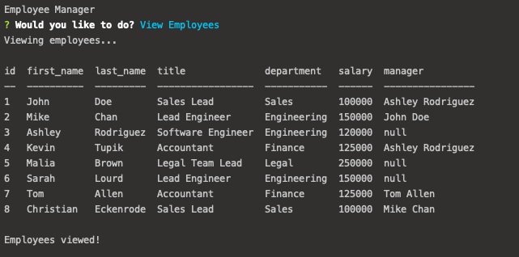

# SQL-Employee-Tracker

Developers are often tasked with creating interfaces that make it easy for non-developers to view and interact with information stored in databases. Often these interfaces are known as **C**ontent **M**anagement **S**ystems. In this homework assignment, your challenge is to architect and build a solution for managing a company's employees using node, inquirer, and MySQL.

## Demo 


## Description
* Functional application.

* GitHub repository with a unique name and a README describing the project.

* The command-line application should allow users to:

  * Add departments, roles, employees

  * View departments, roles, employees

  * Update employee roles

## User Story
```
As a business owner
I want to be able to view and manage the departments, roles, and employees in my company
So that I can organize and plan my business

```


# Tech Used
- Inquirer
- MySQL
- Console.table
- Javascript
- Node.js

## Installation
1. Clone from GitHub
2. Open project directory, then npm install to install all required dependencies 

## Usage
1. Install npm init -y to create a new .json file
2. npm i
3. npm i inquirer
4. npm i mysql
5. npm i console.table
6. Turn on your local MySql server and source schema and seed databases
7. Run node server.js
8. Make sure server.js is connected to SQL before continuing
9. Run through prompts as desired 

## Repository

  - [Project Repo](https://github.com/saumilkt/SQL-Employee-Tracker)
